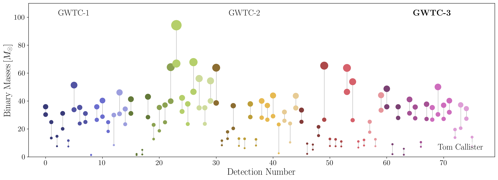

<!-- Main -->

<!-- One -->
<section id="one">
	

		
I spend a lot of time making plots and graphics for talks, and sometimes I'm asked to share these for others to use. This page links to some recent figures, as well as the code used to generate them. Please use in your own talks and presentations! (If you do so, please credit me! You can even star the linked GitHub repos if you wish.)

	

</section>

<!-- Two -->
<section id="two" class="spotlights">
	<section>
		
		

			

				<header class="major">
					<h3>Landscape of Compact Binary Detections</h3>
				</header>
				    

                    This plot illustrates the masses of all compact binary mergers detected via gravitational waves.
                    The <a href="https://github.com/gw-gallery/cbc-landscape/tree/main">GitHub page</a> for this image contains additional images breaking this landscape down by individual catalog releases, as well as an "honest" version of this plot showing uncertainties on measured masses.
                    

			

		

	</section>
	<section>
		
		

			

				<header class="major">
					<h3>Non-parametric BBH populations paper in PRX</h3>
				</header>
				    

                    At long last, <a href="https://journals.aps.org/prx/abstract/10.1103/PhysRevX.14.021005">this paper</a> has been published in PRX!
                    Will and I measure the black hole population using an autoregressive process model for the black hole merger rate (this involves doing hierarchical inference with hundreds of thousands of free parameters), checking the robustness of known features and finding fun new ones.
                    This paper was flagged as a "Featured" article.
                    

			

		

	</section>
</section>

