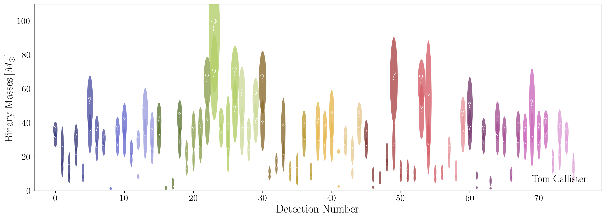

<!-- Main -->

<!-- One -->
<section id="one">
	

		
I spend a lot of time making plots and graphics for talks, and sometimes I'm asked to share these for others to use. This page links to some recent figures, as well as the code used to generate them. Please use in your own talks and presentations! (If you do so, please credit me! You can even star the linked GitHub repos if you wish.)

	

</section>

	

        <h3>Faucibus consequat lorem</h3>
        
Nunc lacinia ante nunc ac lobortis. Interdum adipiscing gravida odio porttitor sem non mi integer non faucibus ornare mi ut ante amet placerat aliquet. Volutpat eu sed ante lacinia sapien lorem accumsan varius montes viverra nibh in adipiscing blandit tempus accumsan.

    

    

		
		
    

    <h3>Compact binary landscape</h3>
	

		

		

    

    
Nunc lacinia ante nunc ac lobortis. Interdum adipiscing gravida odio porttitor sem non mi integer non faucibus ornare mi ut ante amet placerat aliquet. Volutpat eu sed ante lacinia sapien lorem accumsan varius montes viverra nibh in adipiscing blandit tempus accumsan.

	

		

		

    

	

		

    

