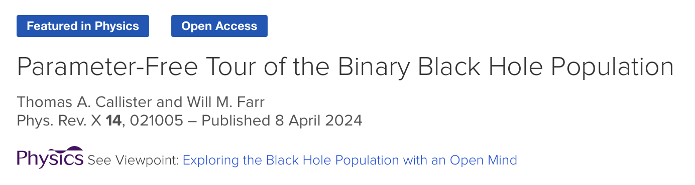

<!-- Main -->

<!-- Two -->
<section id="two" class="spotlights">
	<section>
		
		

			

				<header class="major">
					<h3>Orci maecenas </h3>
				</header>
				
Nullam et orci eu lorem consequat tincidunt vivamus et sagittis magna sed nunc rhoncus condimentum sem. In efficitur ligula tate urna. Maecenas massa sed magna lacinia magna pellentesque lorem ipsum dolor. Nullam et orci eu lorem consequat tincidunt. Vivamus et sagittis tempus.

				<ul class="actions">
					<li><a href="generic.html" class="button">Learn more</a></li>
				</ul>
			

		

	</section>
</section>

